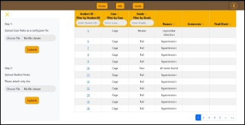
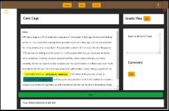

MedEval – Software platform to rate clinical notes by medical students

Project Team:   Sailesh Devkota, Justin Jones, Tirth Patel, Sabri Anan

*Computer Science*

Project Number CS 23-302

Faculty Advisor:  Bridget T. McInnes, PhD

Sponsor:  Wright Center

Mentor:  Amy L. Olex, PhD , Adam Garber, MD

Technical Advisor: Evan French, MS 

Medical education heavily relies on practical experiences, such as mock patient interviews, for students to practice diagnostic and treatment skills. They write medical notes summarizing findings and proposed treatments, which educators evaluate for understanding and feedback. Manual grading is time-consuming, assessing interview proficiency, accurate documentation, relevant tests, and correct diagnoses. We introduce MedEval, a web application automating medical note grading during mock interviews.

MedEval uses NLP techniques to analyze notes, identifying the presence and accuracy of medical terms per case defined by educators. Each note is divided into four sections: Subjective, Objective, Assessment, and Plan. The application pulls the grading rules from a configuration file that can be changed to fit the needs of each use case, for example, a certain case may require that the Subjective section specifies hypertension as a symptom. For each section, the user defines which terms are needed for the note to pass without review, or be flagged as a note that needs more review. If any of the terms that are designated as essential by the user are missing, the note is flagged to fail without review. The user-friendly interface, crafted with React and Bootstrap, has two panels for seamless navigation. The left panel offers data management tools, such as uploading medical notes and config files. The center panel displays real-time grading result visualizations, enabling educators to quickly identify areas where students excel or struggle.

Future plans include identifying patterns in student understanding of medical terminology and implementing a student interface for direct note submission. By pinpointing areas where students may need additional support, MedEval empowers educators to tailor their teaching strategies to improve student performance and ensure a smooth transition into professional practice.

