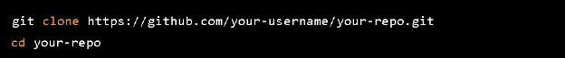

# VSCode Installation- Code Editor
# To install Visual Studio Code (VSCode), you can follow these steps:
1. # Go to the official VSCode download page at ‘**https://code.visualstudio.com/download’.**
1. # Click on the appropriate download link for your operating system (Windows, macOS, or Linux).
1. # Follow the installation wizard instructions to install VSCode. On Windows, you'll need to run the downloaded .exe file and follow the prompts. On macOS, you'll need to drag the downloaded .dmg file to the Applications folder. On Linux, you'll need to use the appropriate package manager for your distribution to install VSCode.
1. # Once the installation is complete, you can launch VSCode by opening the application from your Start menu (on Windows) or Applications folder (on macOS), or by typing **code** in a terminal window (on Linux).
# Prerequisites

Before you can run this app, you'll need to have the following installed:

- Node.js version 14.x or higher
  - <https://nodejs.org/en/download>

- npm version 7.x or higher
  - <https://docs.npmjs.com/downloading-and-installing-node-js-and-npm>

- Python version 3.8.7
  - <https://www.python.org/downloads/release/python-387/>

# Installation
1. Clone the repository:

- # Installation for the interface

1. Install the dependencies:

—-------------------------------------------------------------------------------------------------------------------------

Here's an example of how you could install **only the required dependencies** for a React app:

1. Open your terminal and navigate to the root directory of your React app.

1. Run the following command to install only the required dependencies:

This will install only the runtime dependencies for your React app, skipping the development dependencies.

*Note: Before running the command, make sure that you have Node.js and npm installed on your machine, and that you have a package.json file in your app directory that specifies your app's dependencies.*

—-------------------------------------------------------------------------------------------------------------------------

1. Start the development server:

1. Open your browser and go to ‘**http://localhost:3000’** to see the app running.
# Configuration

If you need to configure the app, you can do so by setting environment variables. Create a file called .**env.local** in the root of your project and add your variables like this:

# Troubleshooting
If you encounter any issues while installing or running the app, try the following:

- Make sure you have the correct version of Node.js and npm installed.
- Delete the **‘node\_modules**’ folder and run ‘**npm install’** again.
- Check the console for any error messages and try to resolve them.
# Build and deployment

To build the app for production, run the following command:

This will create a ‘**build’** folder containing the optimized production build of your app. You can then deploy this to a web server or hosting platform of your choice.

- # Installation for the NLP server

1. Install the dependencies:Install the dependencies: 

1. Run the server using:

