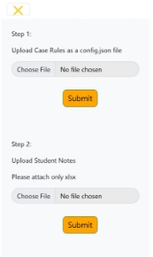
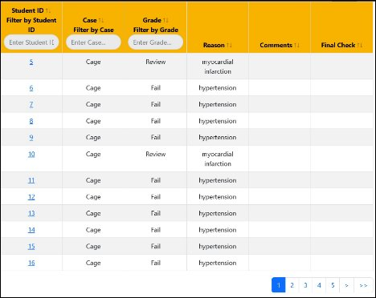
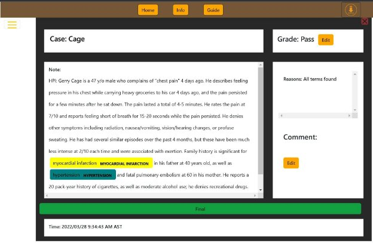

MedEval Overview
 
 
I. Introduction

- Brief overview of MedEval application
- Purpose and benefits of using MedEval

II. Usage Instructions

- Step-by-step guide for using MedEval
- Uploading data and config files
- Interpreting the grading results
- Sending the final result to the server

III. Data File Format

- Description of required format for data files
- Column names and data types
- Examples of valid data files

IV. Config File Format

- Hierarchical structure of config files
- Explanation of Fail and Review sections
- Types of rules for CUI search and Term search
- Examples of valid config files
- Reminder for using regular expressions

V. Regular Expressions

- Explanation of regular expressions
- Formats for single-word and multiple-word terms
- Using multiple options with the pipe character
- Resources for learning and testing regular expressions

VI. Conclusion

- Recap of benefits and usage instructions for MedEval
- Potential impact on medical note grading process.

**Introduction**

This application allows users to grade medical notes and have a review via the application without programming or having to become a NLP expert. The application starts its work when the user uploads the excel and appropriate config file in json format to the upload sections. The application then takes those files for grading and returns the results to the user. If all keywords match with the rules in the  config files then it grades as ‘Pass’, for partial matches it grades as ‘Review’  and if any important terms are missing it grades as ‘Fail’. The ultimate outcome is presented in a convenient table format. If desired, the user can simply click on the corresponding student ID to seamlessly transition to a more detailed view of that specific note.

Results can be downloaded as an excel file to a local machine.
#
#
#
#

# Usage Instructions
Getting Started 

Step: 1 **Upload datasheet and config file**

Step: 2 **Opens the Table**

Step 3: **You can click on ID**

Step 4: **Pass, Fail or Review , then Comment and Finally Click on Final.**

**Once Final is Clicked then it is sent to the server.** 
## **Data File Format**
- The file format has to be .xlsx
- The column names will be as follows - Timestamp( date as year month and day, time as hour minutes second, am or pm as in time region), Student\_ID(number as format), Case( has to be same as config file), Subjective(String), Objective(String), Assessment(String), Plan(String)

## Config File Format
- The config file follows a hierarchical structure, as shown here:
- Case
  - Subjective
    - Fail
    - Review
  - Objective
    - Fail
    - Review
  - Assessment
    - Fail
    - Review
  - Plan
    - Fail
    - Review
- For each section, the rules in the Fail section will all be checked. If any of these terms are missing, the section will be marked to fail. The program will then check the Review section. If all terms in the Review section are present, the note will be marked to pass without review; otherwise, it will be marked as for review.

- There are two possible types of rules:
  - CUI search
    - The term will be searched for based on the Concept Unique Identifiers (CUIs) given. 
  - Term search
    - The term will be searched for based on a regular expression
- Each rule must contain the **name** of the term being searched for
- The only other required header is the CUIs to be searched for or term to be searched for
- The config file uses a format called json, which stands for javascript object notation. Every section must be surrounded by curly brackets {} or square brackets [] if there are multiple items.
- To create a new case, first create a name for the case, and then add it using this format:

(it is ok to just copy and paste this in, be sure to include the comma before case name)
,"case name" : {

` `"subjective" : {

"fail" : [

],

"review" : [

]

},
` `"objective " : {

"fail" : [

],

"review" : [

]

},
` `"assessment" : {

"fail" : [

],

"review" : [

]

},

` `"plan" : {

"fail" : [

],

"review" : [

]

}

`	`}

- To add a rule to a respective section, inside the square brackets, insert the rule using this format:
  {
  `	`“name” : “term name”,
  `	`“term” : “regular expression”
  }
- Or you can use this format for a CUI search:
  {
  `	`“name” : “term name”,
  `	`“cuis” : [“cui1”, “cui2”]
  }
- A few reminders: 
  - Whenever you have multiple sets of rules, place a comma after the curly brackets
  - Every string should have quotation marks surrounding it
  - Save the file before attempting to edit so that you have a working copy to return to should anything go wrong
  - Don't forget commas after the term name
- Regular expressions
  - Regular expressions are blocks of text that use special characters to denote rules that define patterns for the app to search for. The app will do most of the heavy lifting, but to search for a specific term all you need to do is follow this format for the regular expression:
    **Single word:** (word)
    **Multiple word term:** (word)\\s+(word)\\s+(word)
    **Multiple different options:** Enclose each expression with a set of parentheses, and then separate each option with the pipe character: |
  - The website [regexone.com](https://regexone.com/) provides tutorials and resources for learning how to construct more advanced regular expressions
  - The website [regexr.com](https://regexr.com/) provides an environment to test regular expressions to make sure that they correctly identify the terms before placing them into the config file.
- Sample config file:

